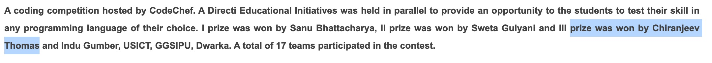

Hi 👋  My name is Chiranjeev
=========================================================================================================================================

#### **` I'm a Full Stack Web Developer | StartUp Founder `** ####

I've been coding for the past 5 years. I started as a Backend Java Engineer at dDriven (A startup in Bengaluru, India) and later went on to work as a Full Stack Web Developer ( M.E.R.N stack ) at 2 Tech Startups that I founded.

* 🌍  I'm based in Bengaluru, India
* 🖥️  Read my Blog : [Chiranjeev's Blog](http://www.chiranjeevthomas.com)
* 🚀  I'm currently working on [DevReferral](http://www.devreferral.com)
* 🧠  I'm build my projects using MongoDb | Next.Js | Express | React | Node.js
* 🤝  I'm open to collaborating on M.E.R.N Projects ( Commercial )
* ⚡  I love CATS ! ! 🐱

--------------------------------------------------------------------------

##### **`Top Comment from my Code Quality Review Report:`** #####

### *\" Secure programming, defensive programming, functional programming, Test-driven development devote an obvious critical analyzer, neat codes and cohesive abstractions, full-stack knowledge. He's got it all \"*

 \- _Software Engineering Expert ( Indorse )_ 

 ###### Indorse is a Skills Assessment Platform, where a panel of experts coming from all over the world review candidates on their software development skills. These code reviews are done on candidates’ existing open-source projects or on a particular assignment that our clients ask the candidates to undergo.
 
\-\-\-\-\-\-\-\-\-\-\-\-    
[Source Link](https://bit.ly/3iTi5gZ)  
\-\-\-\-\-\-\-\-\-\-\-\-    

 ---------------------------------------------------

##### **` Represented University in Coding Competitions: ( Won Cash Prize ) `** #####

\-\-\-\-\-\-\-\-\-\-\-\-    
 [Source Link](https://www.lbsim.ac.in/news/lbsim-organised-innotech-2016-on-march-05-2016/35 "link to competetion article")   
\-\-\-\-\-\-\-\-\-\-\-\-  

 ---------------------------------------------------

### Skills

 
 
  
   
   
    
    
  
   
    
  

---

### Socials

    

---

 

---

<b>Top Repositories</b>

 
 
   
 
   

   

 

       
